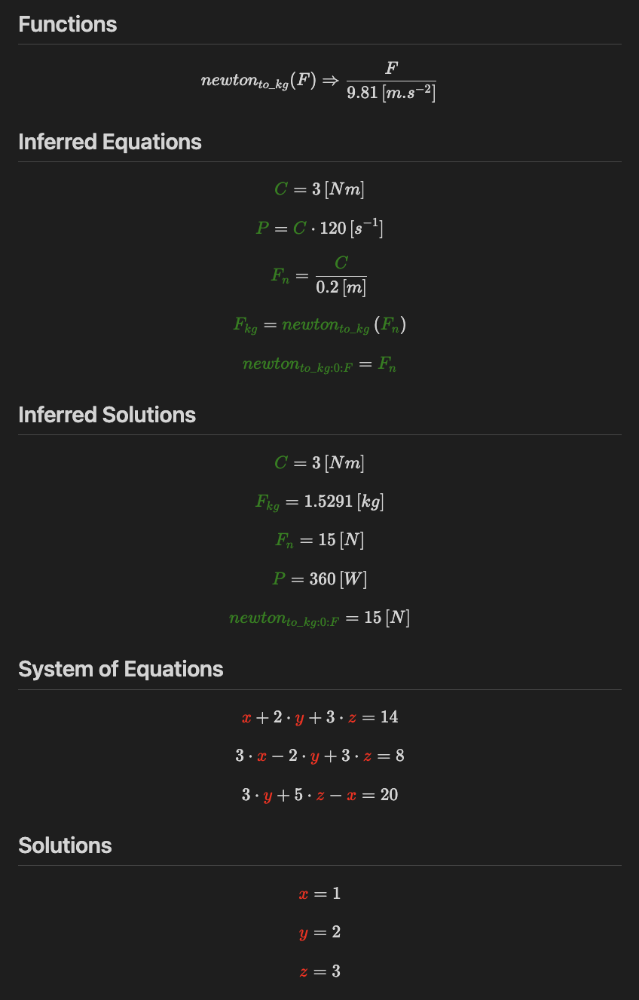

# Equation Solver Language

Implementation of a compiler for equations systems.

## Example

Code:
```txt
function newton_to_kg(F)
{
    return F / 9.81 [m s-2]
}

C = 3 [Nm]
P = C * 120[s-1]
F_n = C / 0.2 [m]
F_kg = newton_to_kg(F_n)


x + 2*y + 3*z = 14
3*x - 2*y + 3*z = 8
3*y + 5*z - x = 20
```

Markdown output (as image because of the GitHub markdown rendering):




## Usage
```sh
./es system_of_equations.eqs
```

## Features
- Linear and non-linear equations systems
- Equations inferrence
- SI units, derived units, units inferration
- Functions
- Guesses (for better convergence)

## Todo
- Add support for SI units in functions
- Add support for prefix units
- Add support for derived units
- Add support for libraries

## References
- GNU/GSL root finding: https://www.gnu.org/software/gsl/doc/html/multiroots.html
- Units: https://en.wikipedia.org/wiki/International_System_of_Units
